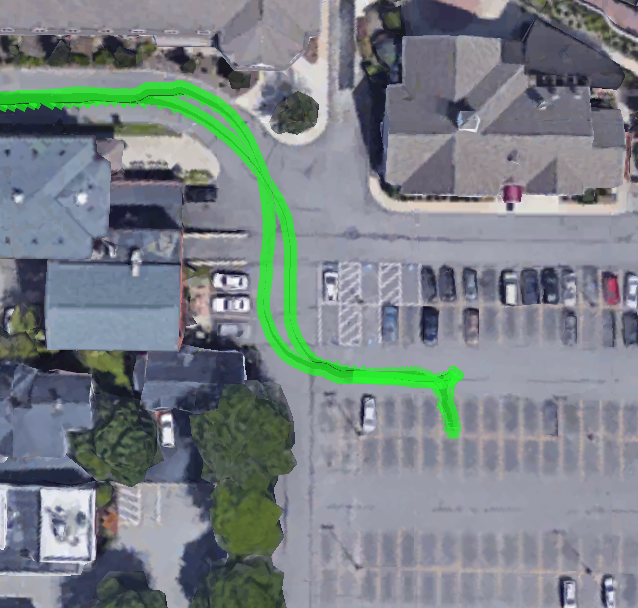
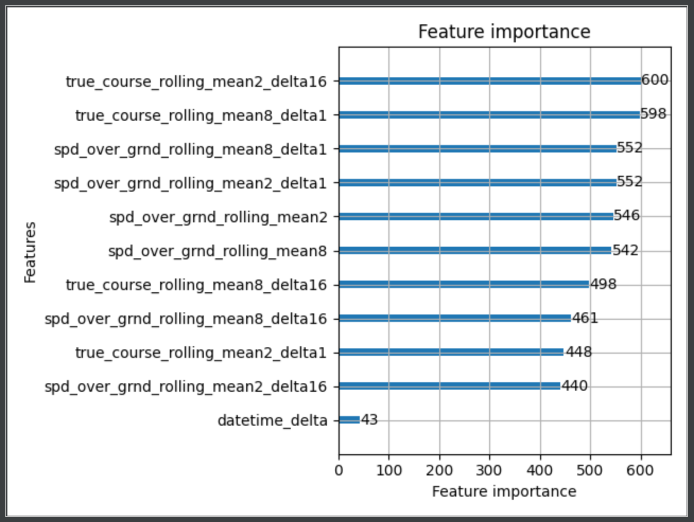
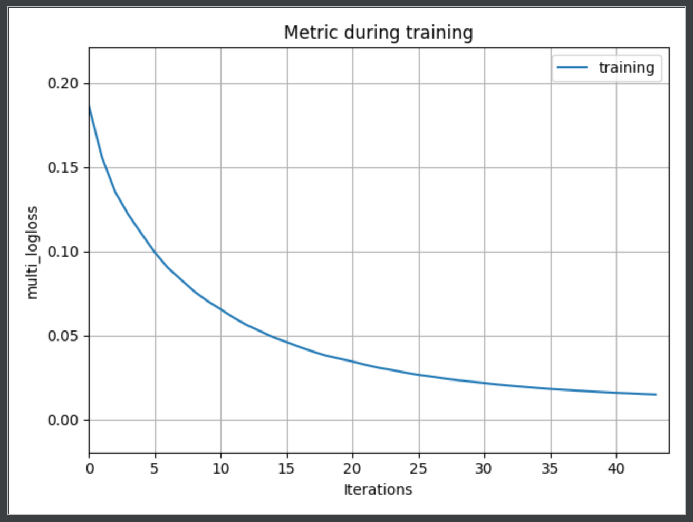
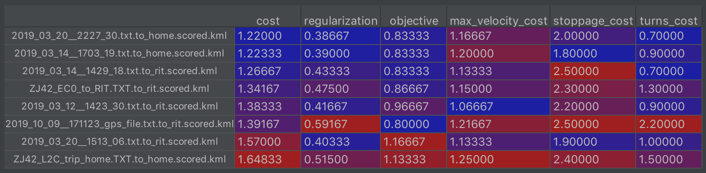
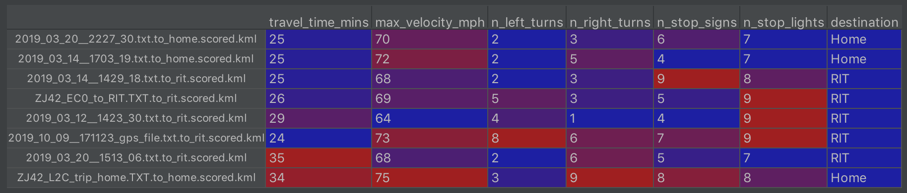

# Abstract

The goal of this project is to find the most efficient routes going to RIT from the professor's home and vice versa. To score and rank routes, a cost function is designed that prioritizes the travel time of the route. The cost function also penalizes route statistics such as the number of left turns, and the number of stop signs. In order to determine these statistics, a classifier is trained on routes with labeled data, allowing left turns, right turns, stop signs, or stop lights to be recognized on unseen route data. The result is that we now have a ranking for routes which either go to or from RIT and the professor's home.

# Overview

To solve the problem of scoring routes the following steps were necessary:

    1. Investigate the data
    2. Design a cost function
    3. Choose a learning method and algorithm
    4. Label training data
    5. Preprocessing and feature creation
    6. Model parameter tuning, training
    7. Route scoring and evaluation

# 1. Investigate the data

It was important to understand the available route data before making decisions about the cost function and how to determine stops and turns in a route. Google Earth was used to explore the route data, which required converting the NMEA GPS data to KML format. The Python package pynmea2 was used to parse the gps data, and the KML output is handled by the project. In Fig.1 we can see an overview of all the routes. While we investigated the route data we learned that it would be necessary to ignore the coordinates and direction as features, as these did not provide contrast against surrounding coordinates. 

By analyzing the routes we could see that there were many more normal coordinates rather than coordinates that were part of a turn or stop. Many of the observations made during this step motivated later decisions, such as using a Gradient Boost Tree to deal with the class imbalance. The similarity between interesting and non interesting coordinates, such as a low speed left turn on a local road versus a turn at a junction, made it clear that the creation of additional features describing changes over a time window would be necessary. 

It was also in this investigation step where we decided to focus on just comparing routes against other routes that start and end in the same locations, meaning that one route has been found to be optimal for going to RIT from the professor's home and one route has been found to be optimal for going to the professor's home from RIT.

After thoroughly investigating the available route data, it was clear that the majority of time spent on the project would be in labeling, and preprocessing the data. We decided that the creation of new routes by assimilation was out of scope for the project given the time available to complete the project. Although new routes would not be created, we saw that we could utilize information across routes to determine the location of traffic lights or stop signs. This would allow a route passing straight through a green light to still have that light penalize the route score, or for a route where the stop sign would otherwise go undetected still have it penalize the route score. Another observation was that some routes contained data where the professor parks at a location before continuing the route. It would be necessary to ignore the time spent parked as to not have that time count against the score of the route. In Fig.2 we can see a case where the professor parks for an errand.

There were a few issues observed with the data. It was observed that the data was particularly noisy when quickly coming from a high to low speed, or when having been in the same position for some period of time. There were rare occasions where there would be a large gap in the data, or the coordinates would suddenly jump to another part of the globe.




\clearpage
\pagebreak

# 2. Design a Cost Function

In order to choose between routes with similar travel times, the cost function penalizes turns and passing previously seen stop signs or stop lights.

The cost function:
```
cost              = objective + regularization
objective         = travel_time(min) / 30(min)
regularization    = (1/10)(max_velocity_cost + turns_cost + stoppage_cost)

max_velocity_cost = max_velocity(mph) / 60(mph)
turns_cost        = (n_left_turns / 5) + (1/2)(n_right_turns / 5)
stoppage_cost     = (n_stop_lights / 5) + (1/2)(n_stop_signs / 5)
```

Where typical route values are:
```
max_velocity: 60(mph)
n_left_turns: 5
n_right_turns: 5
n_stop_lights: 5
n_stop_signs: 5
```

Traffic lights cost twice as much as stop signs, as they are associated with high traffic areas and high speed areas, contributing more to gas and tire wear. Left turns cost twice as much as right turns, as they are associated with large periods of waiting for an opening at an intersection.

Stops and turns are identified by training a gradient boosted tree on hand inspected and labeled training routes that have been preprocessed. Training routes contain coordinates that are labeled as being part of either a stop, a left turn, a right turn, or neither.

Unseen route coordinates are preprocessed and then labeled. Routes are then prepared for scoring, scored, and a recommended route is given for going home or to RIT.

# 3. Choose a Learning Method and Algorithm

After observing the class imbalance and similarity between non interesting and interesting coordinate, we decided to use LightGBM for classification, which is a gradient boosted tree. LightGBM's trees are grown leaf wise rather than level wise, and data is binned by default for a performance advantage. The downside to leaf wise tree growth is that it is more susceptible to overfitting. From analyzing the routes it was also clear that additional features would be necessary to distinguish between interesting and non interesting coordinates. This was another motivating factor in choosing to use LightGBM as it would perform well despite a large number of features.

# 4. Label Training Data

Once we decided to use supervised training, we had to choose routes to use for training and label coordinates in those routes where the vehicle is either stopped, turning left, or turning right. Routes that were chosen to be used for training were routes that could not be used to travel to either RIT or to the professor's home. Labeling the coordinates for each route took a considerable amount of time altogether, but it would not take very long to label the coordinates for a new route to be used for training.

# 5. Preprocessing and Feature Creation

For preprocessing, we split the routes that contain data going to RIT and back to home into two different routes. This is done by determining whether the route has parked at RIT, and splitting the route on the point where the vehicle has parked. Because some coordinates in the routes jump to the other side of the globe on rare occasions, a valid area was defined for the route to be contained in. Routes outside of this area are ignored. Routes that never depart or arrive are removed from consideration. A Rectangular region around the professor's home and RIT defines whether the route ever arrives or departs, and whether the route can be used for scoring. As data while stopped does not provide any useful information, any coordinates where the vehicle is not moving are removed.

Features created at this stage include the rolling mean for 2 and 8 of surrounding coordinates. From thse rolling means, delta features were created. The image below show's the importance of each feature for the trained model when making a classification. In order to detect stops a datetime delta column was created. This allowed us to remove the time parked during an errand or activity in order for that time to not penalize the route score.

# 6. Model Parameter Tuning and Training

Before training the model, we explore the parameter space for parameters with the least mean loss for the objective function (multi class log loss) when the parameters are used in cross validation.

The parameter space is explored using the Tree of Parzen Estimators (TPE) algorithm. 10 10-fold cross validation rounds are used to find the parameters resulting in the best mean log loss for a CV round. The cross validation used shuffles the data before splitting into test / train sets and is stratified, meaning that class probabilities are retained in splits class probabilities in splits. Parameters in the search space include the number of leaves in the tree, the minimum number of records in a split, the number of models in the boosting ensemble. 

We found good performance and generalization by a using multi class one versus all objective function. By using multi class OVA, a model is created for each label category. This means 100 boosting rounds results in an ensemble of 400 decision trees for the stopped, turning left, turning right, and default classes. Below we can see the progress with each boosting round. In Fig.3 we can see the importance of the features used. In Fig.4 we can see how the loss function is minimized as the number of models increases in boosting.





\clearpage
\pagebreak

# 9. Route Scoring

With the model trained, unseen route data is preprocessed, and labeled using the model. Routes containing a large gap in the data are removed from consideration and not scored. The route data is then prepared for scoring by collapsing stop coordinates and turn coordinates into single points. Stop signs are determined to be coordinates where the median time stopped at that location across routes is at least 1 second, stop lights at least 10 seconds. Because coordinates where the park time was over 15 minute are removed, the amount of time the car is parked does not contribute to the cost. In Fig.5 we can see the cost and cost components for each route, Fig.6 route statistics. 

The best route to RIT was found to be 
```
out/scored_unseen/2019_03_20__2227_30.txt.to_home.scored.kml
```
The best route from RIT to home was found to be 
```
out/scored_unseen/2019_03_14__1429_18.txt.to_rit.scored.kml.
```
Looking at the components of the cost function, we can see that while these two routes had a good baseline cost due to the travel time. We can also see that these routes ranked the highest primarily as a result of their travel time, but as well as having fewer stop lights, stop signs, and a lower max velocity overall. It's important to note however that the higher ranked routes may have ranked well as a result of missing stop signs, stop lights, or turns. It's also important to consider that traffic may have caused a route that otherwise would have scored well to score badly. In Fig.7 we can see an example of a scored route.






\clearpage
\pagebreak

# Discussion and Summary

The biggest problem having decided to use supervised learning is the need to label training data. In addition to the manual labeling taking a very long time to do, it is easy to mislabel or miss data that should have been labeled. The downside to the method we used to detect stop sign and stop light locations based on data across multiple routes is that for each route being scored, it's necessary to find the coordinates that are the closest to the known stop locations. This is computationally expensive, however greatly increasing the ability to detect stop lights and stop signs when scoring routes.

After working on this project we learned the importance of fully understanding the data you are working with. We learned that it payed to investigate the data to get a feel for how reliable the data is, as well as how hard it would be to detect what you are interested in. We also learned that it is important to have domain knowledge in the data you are analysing, as this knowledge allows you to create or remove features that help detect what you are interested in. We also learned about gradient boosted trees and their ability to classify highly imbalanced or difficult data sets, as well as parameter optimization using TPE and cross validation. We realized the importance of reducing the amount of data to process. By removing coordinates that did not change location from the last coordinate on the route, the time necessary to preprocess and train was reduced considerably. In a future project we would likely combine information about each record within a window into a single record to encapsulate the relationship between coordinates within that window, as well as to reduce the number of records to be processed in training, classification, and post processing. 

Because the project also written in a way such that new routes can be scored, we also learned about the importance of creating generalized solutions. With some modification, the project in its current state can be adapted to score routes between locations other than RIT and the professor's home. 
